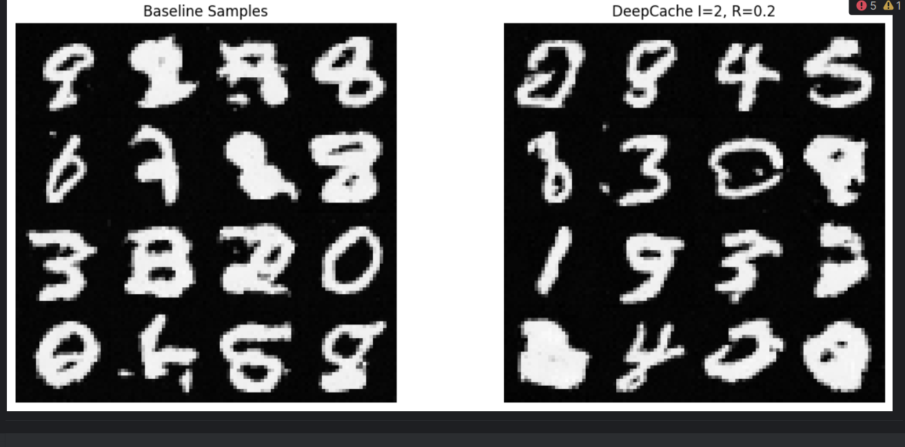

# Generative AI CV HW2&3

I have decided to implement everything using Pytorch Lightning to speed up the dev process.

## DDPM and DDIM 

The backbone of this implementation is an unconditional U-Net architecture. The U-Net has only 3 layers for us 
to not overfit on such simple dataset. 

- **Input Processing**: Handles 1-channel grayscale MNIST images (28×28 pixels)
- **Channel Progression**: Starts with a base of 64 channels, then follows a 64→128→256→128→64 channel pattern
- **Time Embedding**: Uses sinusoidal positional encoding (`SinusoidalPosEmb` class) to represent timesteps
- **Symmetric Structure**: Contains a downsampling path, bottleneck, and upsampling path with skip connections

The Uncoditional DDPM during forward diffusion gradually adds noise to the original image according to a predefined schedule, 
denoises images step by step during sampling. We also use DDIM Sampling, where we use
deterministic sampling with fewer steps than training.

Sinusoidal positional embeddings encode each discrete diffusion time step into a fixed high-dimensional vector using sine and cosine 
functions with exponentially scaled frequencies, enabling the MNIST diffusion model 
to capture continuous temporal dependencies and precisely modulate the noise schedule 
across denoising iterations

## Latent diffusion
I have used a different VAE for this task to fit for a data with less dimensions.
First, a VAE compresses down to just 16 latent dimensions through a convolutional encoder.
 Instead of adding noise to pixels, the model adds noise to these latent vectors and then learns to reverse this process. 
The diffusion model uses simple MLP blocks instead of convolutional layers since it's working with flat vectors rather than images.

## Conditional classifier-free diffusion
We combine input channel conditioning and cross attention mechanisms.
During training, class labels are randomly dropped (replaced with -1) with probability drop_prob.
During sampling, both conditional and unconditional predictions are generated, then combined using a guidance scale:
eps = eps_uncond + guidance_scale * (eps_cond - eps_uncond)

## Rectified Flow
Pixel-Space Rectified Flow models image generation by learning a direct vector field that transforms noise to data along
a straight-line path. Unlike traditional diffusion models that gradually add and remove noise, this approach formulates generation 
as solving an ordinary differential equation (ODE). The implementation uses a U-Net architecture conditioned on time to predict the
vector field at interpolated points between real images and noise. During training, it minimizes the MSE between predicted and true vectors,
while sampling employs a simple Euler method ODE solver that starts from random noise and iteratively follows the vector field for a fixed number 
of steps to reach the data distribution.

Latent Rectified Flow combines a VAE with Rectified Flow in a compressed latent space for more efficient generation. This two-stage approach first 
encodes images into a 128-dimensional latent representation using a CNN with attention mechanisms, then applies Rectified Flow in this reduced space 
using an MLP with residual blocks. 

## DeepCache
The implementation uses PyTorch's forward hook mechanism to intercept and modify layer outputs during inference. 
At designated caching steps, DeepCache stores the output features of residual blocks; during subsequent steps, it performs linear interpolation between cached features and current computations. 
The technique is evaluated through FID, MSE and speedup is measured for different skip steps.

## ControlNet
The model takes blank (zero) images as input alongside edge maps. 
The ControlNet processes edge maps and extracts features at multiple resolutions.
These control features are injected into the U-Net at corresponding levels.
The model learns to reconstruct the original digits using only edge information
L1 loss trains the model to generate images matching the original digits

